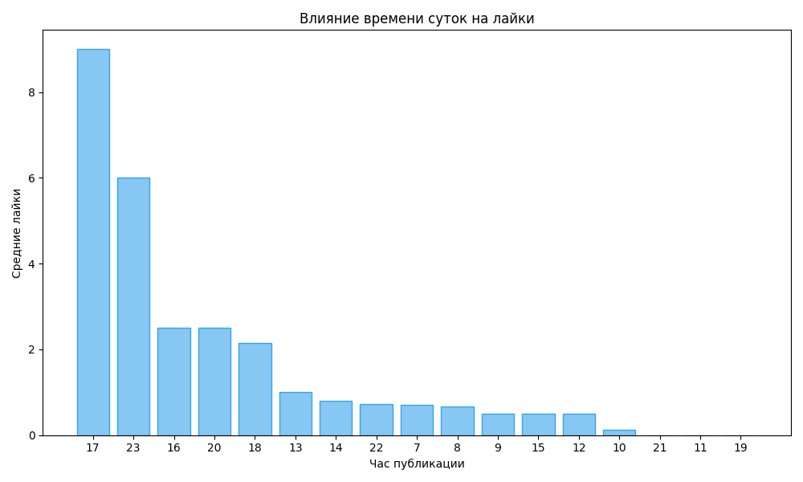
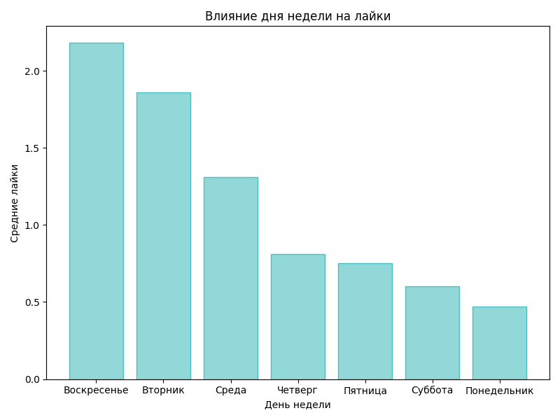
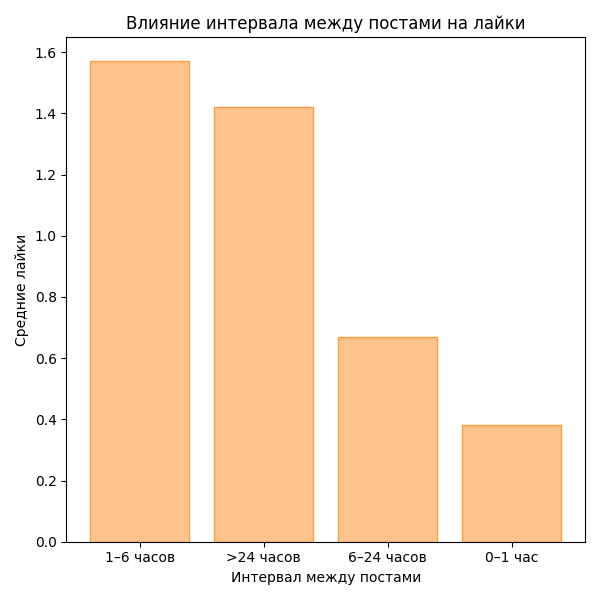

# Анализ влияния факторов на количество лайков постов ВКонтакте

## Оглавление

-   [Описание задания](#описание-задания)
-   [Данные](#данные)
-   [SQL-запросы и пояснения](#sql-запросы-и-пояснения)
    -   [Влияние времени суток](#влияние-времени-суток)
    -   [Влияние дня недели](#влияние-дня-недели)
    -   [Влияние промежутка между постами](#влияние-промежутка-между-постами)
-   [Результаты](#результаты)
    -   [Влияние времени суток](#результаты-влияние-времени-суток)
    -   [Влияние дня недели](#результаты-влияние-дня-недели)
    -   [Влияние промежутка между постами](#результаты-влияние-промежутка-между-постами)
-   [Визуализация](#визуализация)
-   [Вывод](#вывод)

## Описание задания

Цель: определить, что больше влияет на количество лайков постов на странице ВКонтакте — время суток публикации, день недели или промежуток между постами. Данные о постах (дата публикации и количество лайков) собраны через API ВКонтакте, сохранены в формате CSV, загружены в базу данных PostgreSQL и проанализированы с помощью SQL-запросов.

## Данные

Данные о постах собраны с помощью API ВКонтакте и сохранены в файл `vk_posts.csv`. Пример структуры данных:

```csv
post_date,likes
2025-07-01 07:00:00,1
2025-07-01 07:30:00,0
2025-07-01 08:00:00,2
2025-07-01 09:00:00,1
2025-07-01 10:00:00,0
```

Полный файл `vk_posts.csv` доступен в репозитории.

## SQL-запросы и пояснения

### Влияние времени суток

```sql
SELECT
    EXTRACT(HOUR FROM post_date) AS hour_of_day,
    ROUND(AVG(likes), 2) AS avg_likes,
    COUNT(*) AS post_count
FROM posts
GROUP BY EXTRACT(HOUR FROM post_date)
ORDER BY avg_likes DESC;
```

**Пояснение**: Группирует посты по часу публикации, вычисляет среднее количество лайков и количество постов для каждого часа. Сортировка по убыванию среднего числа лайков показывает, в какое время суток посты наиболее популярны.

### Влияние дня недели

```sql
SELECT
    EXTRACT(DOW FROM post_date) AS day_of_week,
    ROUND(AVG(likes), 2) AS avg_likes,
    COUNT(*) AS post_count
FROM posts
GROUP BY EXTRACT(DOW FROM post_date)
ORDER BY avg_likes DESC;
```

**Пояснение**: Группирует посты по дню недели (0 = воскресенье, 6 = суббота), вычисляет среднее количество лайков и количество постов. Позволяет выявить наиболее благоприятные дни для публикаций.

### Влияние промежутка между постами

```sql
WITH post_intervals AS (
    SELECT
        post_date,
        likes,
        EXTRACT(EPOCH FROM (post_date - LAG(post_date) OVER (ORDER BY post_date))) / 3600 AS hours_between_posts
    FROM posts
)
SELECT
    CASE
        WHEN hours_between_posts <= 1 THEN '0-1 час'
        WHEN hours_between_posts <= 6 THEN '1-6 часов'
        WHEN hours_between_posts <= 24 THEN '6-24 часов'
        ELSE '>24 часов'
    END AS interval_range,
    ROUND(AVG(likes), 2) AS avg_likes,
    COUNT(*) AS post_count
FROM post_intervals
WHERE hours_between_posts IS NOT NULL
GROUP BY interval_range
ORDER BY avg_likes DESC;
```

**Пояснение**: Вычисляет интервал между последовательными постами (в часах) с помощью функции `LAG`. Интервалы группируются в категории, для которых вычисляется среднее количество лайков и количество постов.

## Результаты

### Результаты: Влияние времени суток

| Час | Средние лайки | Постов |
| --- | ------------- | ------ |
| 17  | 9.00          | 3      |
| 23  | 6.00          | 1      |
| 16  | 2.50          | 2      |
| 20  | 2.50          | 2      |
| 18  | 2.14          | 7      |
| 13  | 1.00          | 4      |
| 14  | 0.80          | 10     |
| 22  | 0.73          | 15     |
| 7   | 0.71          | 24     |
| 8   | 0.67          | 3      |
| 9   | 0.50          | 6      |
| 15  | 0.50          | 10     |
| 12  | 0.50          | 2      |
| 10  | 0.13          | 8      |
| 21  | 0.00          | 1      |
| 11  | 0.00          | 1      |
| 19  | 0.00          | 1      |

**Анализ**: Посты в 17:00 получают больше всего лайков (9.00), за которыми следуют 23:00 (6.00) и 16:00–20:00 (2.14–2.50). Утренние и ночные часы имеют низкие показатели (0.00–0.71). Диапазон: 0.00–9.00.

### Результаты: Влияние дня недели

| День        | Средние лайки | Постов |
| ----------- | ------------- | ------ |
| Воскресенье | 2.18          | 11     |
| Вторник     | 1.86          | 14     |
| Среда       | 1.31          | 16     |
| Четверг     | 0.81          | 16     |
| Пятница     | 0.75          | 16     |
| Суббота     | 0.60          | 10     |
| Понедельник | 0.47          | 17     |

**Анализ**: Воскресенье (2.18) и вторник (1.86) — лучшие дни, понедельник — худший (0.47). Диапазон: 0.47–2.18.

### Результаты: Влияние промежутка между постами

| Интервал   | Средние лайки | Постов |
| ---------- | ------------- | ------ |
| 1–6 часов  | 1.57          | 7      |
| >24 часов  | 1.42          | 55     |
| 6–24 часов | 0.67          | 21     |
| 0–1 час    | 0.38          | 16     |

**Анализ**: Посты с интервалом 1–6 часов (1.57) и >24 часов (1.42) получают больше лайков, чем с интервалом <1 часа (0.38). Диапазон: 0.38–1.57.

## Визуализация







## Вывод

**Время суток** оказывает наибольшее влияние на количество лайков (диапазон 0.00–9.00). Посты в 17:00 получают значительно больше лайков (9.00), чем в утренние или ночные часы (0.00–0.71). Однако данные для некоторых часов (17:00, 23:00) основаны на малом количестве постов.

**День недели** имеет умеренное влияние (диапазон 0.47–2.18). Воскресенье и вторник — наиболее благоприятные дни, понедельник — наименее.

**Промежуток между постами** показывает наименьшее влияние (диапазон 0.38–1.57). Интервалы 1–6 часов и >24 часов предпочтительнее, чем <1 часа.
